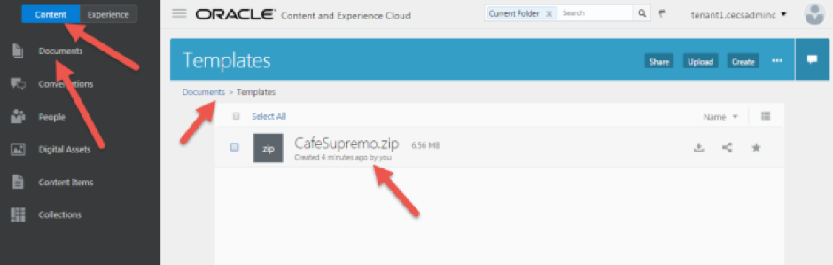
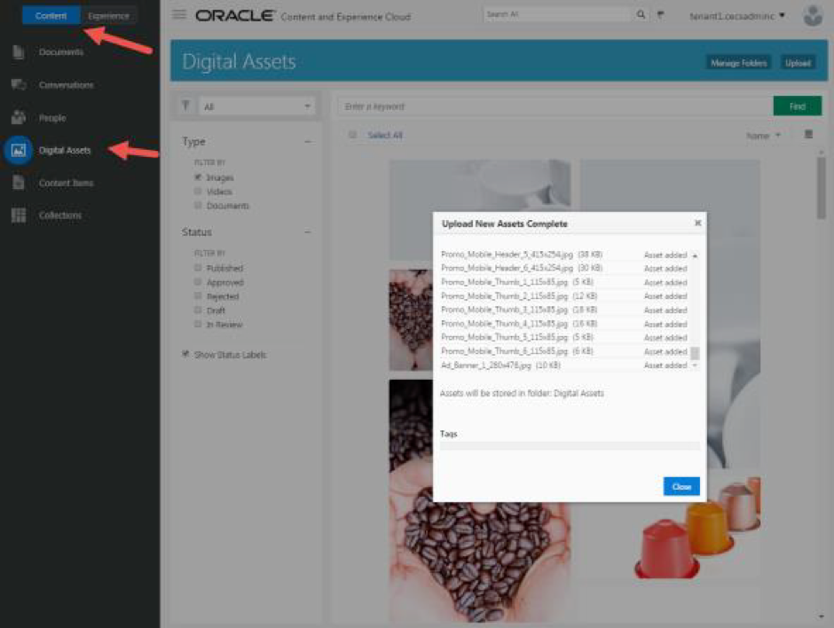

# ORACLE Cloud Test Drive #

## Facilitators Instructions ##

### 1.1. Introduction ###

These steps will show you how to setup the participants environments before commence of the Test Drive.

**Note these steps will need to be repeated for all instances that will be used in the test drive session**

You will be setting up the following: 

1. Create a site using template and create a collection. 
2. Create and publish content items 
3. Learn how to use the content items in sites 

>For a quick view on Content and Experience Browser user interface please click [here](https://docs.oracle.com/en/cloud/paas/content-cloud/user/quick-overview-your-browser-home-page.html).

## Lab Resources ##

1. [CafeSupremo.zip](../resources/CafeSupremo.zip) - CafeSupremo Marketing site template and components 
2. [Images.zip](../resources/Images.zip) – Images required for the CafeSupremo Marketing site.

>**Note:** Click on the links to download the resources to your local machine.

## Lab 1.3. Upload Lab Resources to Content and Experience Cloud ##

### About this Lab ###

You need to upload the resources to your CEC environment. You can upload resources using the Web Interface, illustrated below or make use of the Desktop Client. 

>[What kind of content can I manage?](https://docs.oracle.com/en/cloud/paas/content-cloud/user/what-kind-content-can-i-manage.html)

>[What can I do with my files and folders?](https://docs.oracle.com/en/cloud/paas/content-cloud/user/what-can-i-do-my-files-and-folders.html)

>[How do I upload files?](https://docs.oracle.com/en/cloud/paas/content-cloud/user/how-do-i-upload-files-browser.html)

### Upload Resources ###

1. Login to CEC. 
2. Create a folder in ``Content -> Documents`` called **“Templates”** 
3. Upload or Drag and Drop the CafeSupremo.zip file into the **“Templates”** Folder

 
4. Unzip **Images.zip** into a local folder 
5. Upload or Drag and Drop all images into ``Content -> Digital Assets``. This may take several minutes to import all images. 

6. Click the **Close** button to close the upload pop up window. 

---
# Lab Exercise: #
Next: [Lab 1.2. Lab Resources](102-CecsLab.md) >>

<< [Back to CECS Cloud Test Drive Home](../README.md)
