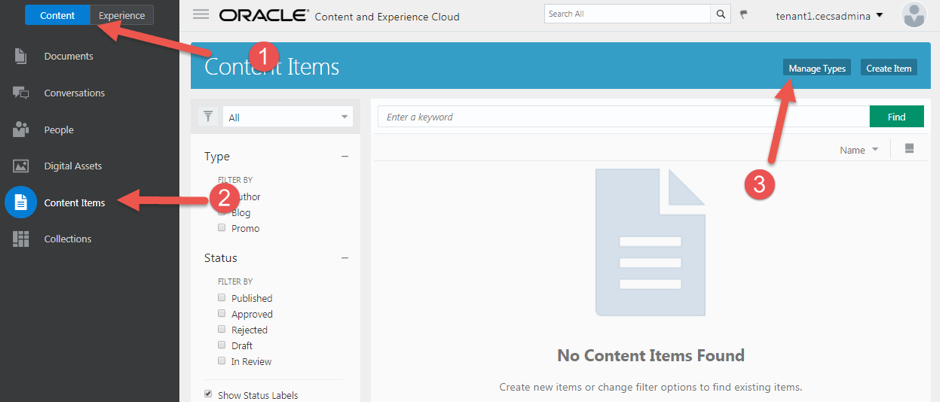
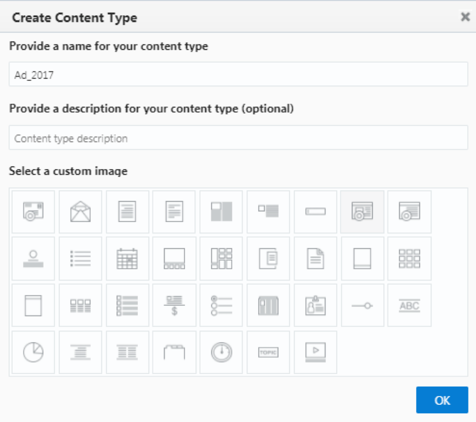
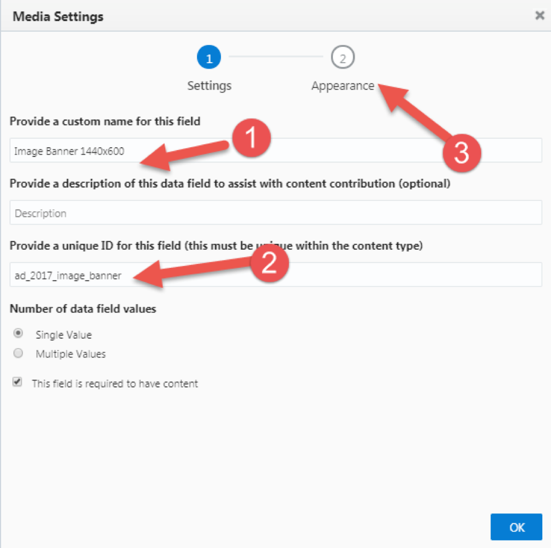
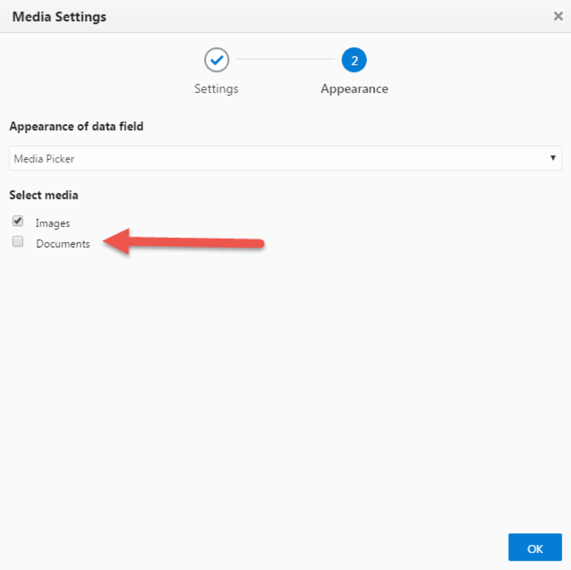
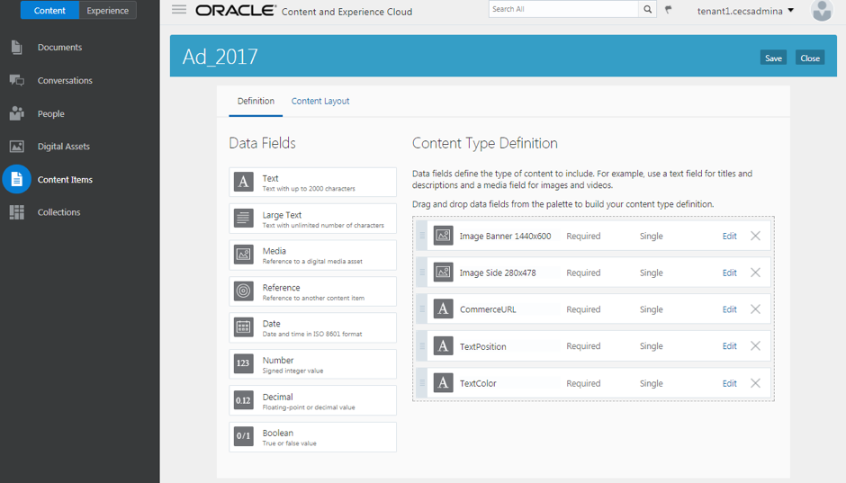
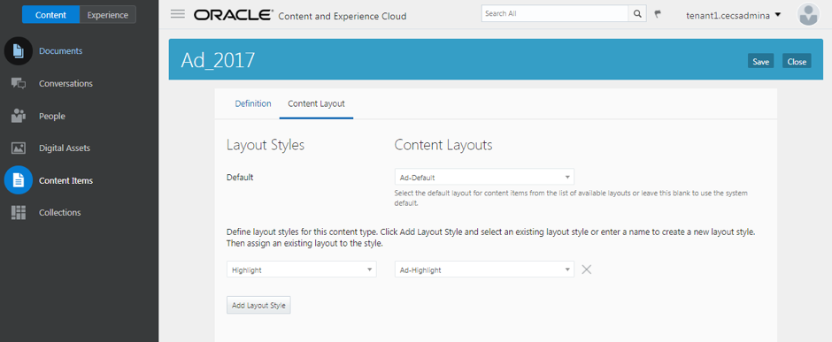
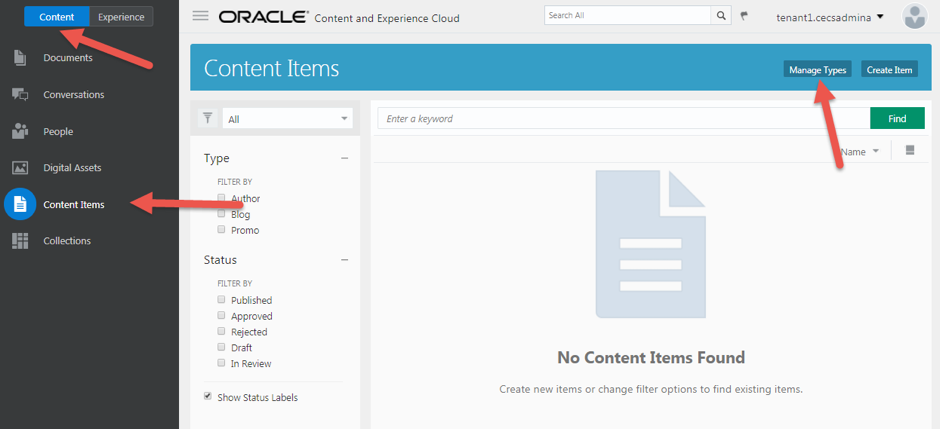
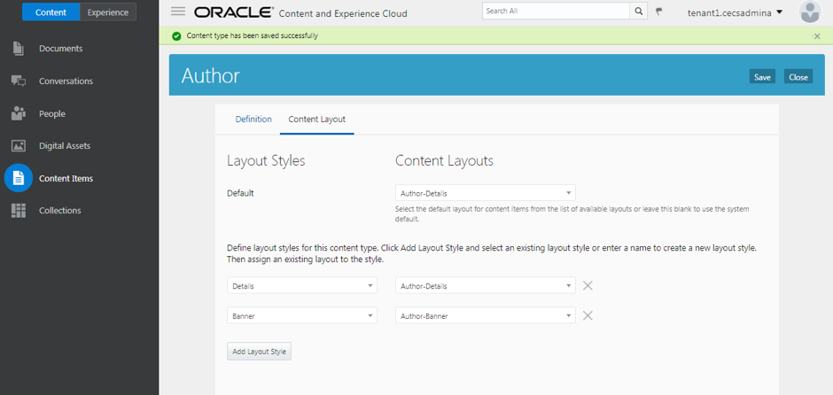

# ORACLE Cloud Test Drive #

## Lab 1.6. Creating Content Type ##

### Introduction ###

In this exercise, you will learn how to create content type. You need to create 1 of the 4
content types used in this exercise:

- Ad_2017– You need to create this content type.
- Author – Provided, but you need to change the content layout.
- Blog – Provided, but you need to change the content layout.
- Promo – Provided, but you need to change the content layout.

### 1.6.1. Creating Content Type ###

1. Navigate to ``Content->Content Items`` page, then click **“Manage Types”**.

2. Click **“Create”** to create a content type.

3. Enter the **“Ad_2017”** as the name of the content type and click OK.

4. Follow the information below to create the content type definition. Drag and
drop a data field into the Content Type Definition placeholder. Once you
dropped a data field into the placeholder, the data field setting screen will
appear.

 

[Content Type Name: Ad_2017](resource/ContentTypes.md)

5. Click the **“Content Layout”** link.

6. Select following content layouts for the layout styles.

>Note: When you import the template, the name of the layout component will
have a running number suffix.

**- Default: Ad-Default**
**- Highlight: Ad-Highlight**

7. If the **“Highlight”** style doesn’t exist, you need to add it by clicking the **“Add
Layout Style”** button, type the name of the style (Highlight) and press the
enter button on your keyboard.

8. Click **“Save”** to save the content type.

### 1.6.2. Change Content Item Layout ###

The Author, Blog and Promo content types were pre-created before you import
the content layout component, you need to configure the content layout for
these 3 content items to render the content item properly.

1. Navigate to `` Content->Content Items->Manage Types ``, and Click the Create
Item button.

2. Click the ``Author content type``, then click the ``Content Layout`` link

3. Change Author content type layout style to:

- Default: Author-Details
- Details: Author-Details
- Banner: Author-Banner

4. Click Save to save the content type

5. You need to repeat this to change the Blog and Promo content type.

- Blog
  - Default: Blog-Default
  - Details: Blog-Details
  - Headline: Blog-Headline
  - Author: Blog-Author
  - Highlight: Blog-Highlight
  - Overlay: Blog-Overlay
  - Banner: Blog-Banner

- Promo
  - Default: Promo-Default
  - Details: Promo-Details

# Lab Exercise: #

[Lab 1.5: Creating a New Site](105-CecsLab.md) | [Lab 1.7: Creating and Publishing Content Item](107-CecsLab.md)
